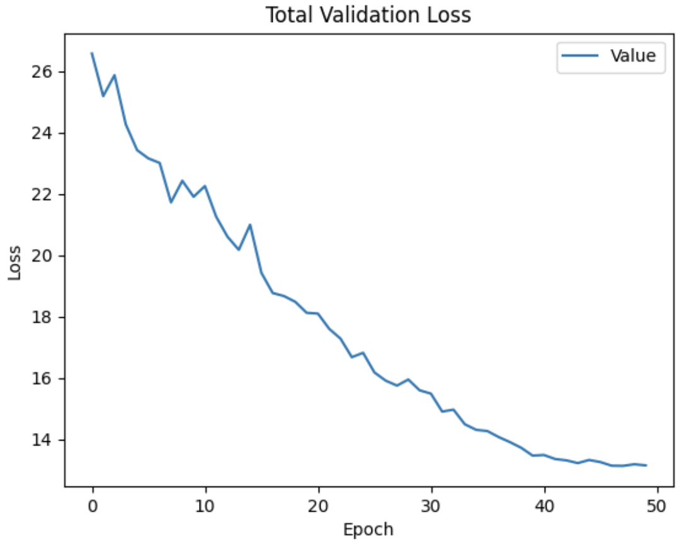

---
documentclass: article
classoption: 
title: "CSCE 585: Machine Learning Systems: 
Milestone 1: Computer Vision Assisted Disaster Rescue"
institute: UofSC
date: \today
colorlinks: true
linkcolor: blue
citecolor: green
urlcolor: cyan
author: Cole Lewis, David Duggan, Daniella Mallari
...

\tableofcontents

\clearpage

# Project Repository
[https://github.com/csce585-mlsystems/CVDisasterRescue 
](https://github.com/csce585-mlsystems/CVDisasterRescue)

# Introduction
The problem in question is how to detect survivors or other victims of a disaster in the affected area by use of both a voice recognition model and an anatomical recognition model. Each model works to employ sensory detection, by “hearing” and “sight” which are provided by microphone and camera respectively, similar to the sensory faculties humans use in their own environments when searching for objects, or people in this case. A multithreaded wrapper program will simultaneously implement these models in real time and provide feedback dependent on what is detected through the camera and microphone. 

# Problem Statement
For the visual recognition of the project, Google’s Open Images Version 6 dataset is being used. In order to narrow the scope of the data and to lessen the model training time, specifically the human-related subsets of the original 1.7 million images are being used in the project. For the voice recognition element, a subset of Google’s Audioset will be used. Audioset contains 527 different classes for sound classification, but the problem being solved is a binary classification of whether a person is speaking or not. The dataset for the model will be 10,000 examples, half being different kinds of speech and the other half being examples of various other sounds.

# Technical Approach
Our real-time detection model will be trained from the dataset referenced above using the YOLOv3-tiny training algorithm. For our voice distinction model, we will construct a convolutional neural network which will be able to distinguish voices from ambient or other sounds.

# Preliminary Results
We trained our model once over 50 epochs with a batch size of 64 images using an AMD Radeon Pro 560X. Plotted below is a figure of how our model performed in regards to validation loss while training.

Early results are promising given the increased batch size and sparse GPU resources, lowering the total loss value from 26.58 to 13.15 over the training session. Our team will be requesting and using stronger, dedicated GPU resources to train the model again with a smaller batch size. Upon attempting to make inferences with the model, we came to find that our images had not been standardized via preprocessing both by number of channels per image as well as size. 
For the next training session, the training set will be altered to only use color images and a consistent size of 1024 by 1024 pixels each.
