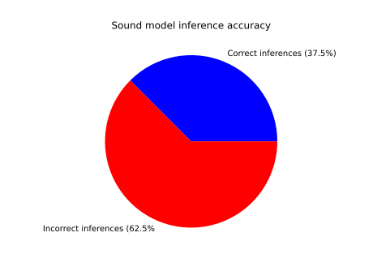

---
documentclass: article
classoption: 
title: "CSCE 585: Machine Learning Systems: 
Milestone 3: Computer Vision Assisted Disaster Rescue"
institute: UofSC
date: \today
colorlinks: true
linkcolor: blue
citecolor: green
urlcolor: cyan
author: Cole Lewis, David Duggan, Daniella Mallari
...

\tableofcontents

\clearpage

# Project Repository
[https://github.com/csce585-mlsystems/CVDisasterRescue 
](https://github.com/csce585-mlsystems/CVDisasterRescue)

# Introduction
Having answered the question of how to meaningfully combine output from both our visual and audial models, the problem in question as it stands is how to improve upon the method by which we filter audial model output to better determine the relative position of a person. The final mechanism we use to localize sound sources will be constrained by considerations such as the environment changing as the mode of deployment moves, movement of the sound sources themselves, and presence of audial noise that would otherwise mislead the model. The constant movement from deployment, and possibly from victims themselves, precludes the use of beamforming or machine learning solutions for source localization since these require strict, careful initialization and training with preset values, none of which can be guaranteed when deployed for real use.

# Problem Statement
We designed and implemented a sound-source localization system currently based from which microphone in the array registered the highest amplitude over the span of the five second recording that our human-originated sound recognition model uses to make inferences. Combining audial outputs from the sound recognition model and visual person-recognition detections, our program can integrate them to produce an informed localization decision. This is done by channel filtering and tracking when somebody was detected by the camera.

# Technical Approach
The sound-source localization system combines the output of the sound classification model and the person recognition model to make an informed decision on the location of a human sound source. The camera/mic array used was a PlayStation Eye accessory. This allowed for one point of hardware where both the video and the sound were recorded. The sound and video systems are threaded so that they run concurrently.The diagram for the system is shown in Figure 1 below.

To localize sound, the audio is first recorded by using PyAudio and the PSeye mic array. This array consists of 4 microphones in a linear configuration. 5 seconds of audio is recorded before it is preprocessed. The preprocessing includes downsampling the audio to 16kHz, cutting it to a consistent length, and converting the waveform into a spectrogram [1]. The spectrogram is then passed to the sound classification model, which predicts whether the sound is human-made or not. Results using different tests on the sound model’s accuracy are shown in the Preliminary Results section below. If the sound recorded is classified as a non-human sound, then the loop goes back to the beginning and another 5 seconds of audio is recorded. A timestamp of when this sound was recorded is also saved for use later. If the sound is classified as a human sound, then the recording is passed to the ranking mechanism to determine the relative direction that sound came from.

Different ranking models were evaluated/researched in the process of designing the system. One approach that initially looked promising was beamforming, which would allow us to determine the exact direction of the sound source. The issue with this approach however, is that the setup needs to be constant [2], and a disaster robot would be moving throughout its environment. A fast system was also necessary, so we decided to use a system that looks at the amplitude across each channel and determines the direction of the sound. Two approaches to this were used, one which chose the channel with the highest instantaneous amplitude, and another which chose the channel with the highest average amplitude across the recording. The results for testing each of these approaches is shown in the Preliminary Results section. To fit the ranking model into the scope of this project, we decided to use rough directions i.e Left, Right, Front, and Back as the relative directions for the sound source. Knowing the loudest channel theoretically allows us to determine the direction of the noise. For example, if the loudest channel was the far-left mic, we know that the sound came from the left of the PSeye and vice-versa. This problem becomes more challenging however, when the loudest sound comes from one of the middle two channels. 

To solve this problem, we used the idea of audial-visual fusion [3]. This involved using the output of the vision system to help determine if someone was in front of the system or behind it when the sound was recorded. The vision system takes in raw camera footage and preprocesses them through pixel normalization. This processed data is then passed into the YoloV4-tiny model trained for person detection. If no human is detected, the loop then just continues to the next frame. If a human is detected, a bounding box is drawn on the OpenCV screen based on the model’s output. The Unix timestamp of when that person was detected is also added to a buffer. This buffer contains timestamps of when a human was detected, and is limited to a size of 110 predictions. 

Buffering the visual predictions allows the two models to communicate with each other. When a sound is determined to have come from one of the two middle channels, the ranking mechanism consults the buffer to see if the vision model saw someone at the time when the audio was recorded. If the ranking mechanism finds the timestamp of the recorded audio, the sound is determined to have come from in front of the PSeye. Else, it's determined to have come from behind the PSeye.

# Preliminary Results
We tested the human-originated sound recognition model for accuracy as well as our two sound localization methods, which are detailed in the above section. Unfortunately, our results were lackluster as each localization method only achieved 10% success rate over 20 trials in a classroom with minimal noise or disruption and at equal distances each trial. Our sound recognition model performed similarly well recognizing human voice 37.5% of the time over 40 trials in identical conditions as trials for sound source localization. This performance is in stark contrast to the 74% accuracy the sound model received on the test set. We believe that the discrepancy in performance is caused by recording the sounds on a different microphone than they were originally recorded on as well as the large amount of noise in a real-world scenario.

While initial results are very poor and will inspire review and possible retraining of our code mechanisms, we must consider the hardware itself as well. The PlayStation Eye was released in 2007 to serve as an accessory to the PlayStation 3. Its chief purpose was to provide a method by which to take pictures of oneself and record greetings, messages, and so on. While it serves its purpose well, fidelity was never prioritized. While the camera’s low 640 by 480 pixel resolution manages our visual person-recognition model well satisfactorily, the microphone’s sample rate is capped at 16 kHz which falls short of today’s audio fidelity standards by far, at least by a factor of four. The layout and size of the microphone array calls the channel filtering methods into question as well. The omnidirectional microphone array on the PlayStation Eye measures 76mm across, and if each of the four microphones were equally spaced apart starting at the end, they would be at most only 19mm apart from each other. The fact of each microphone’s very close proximity to the others poses a problem as there may not be enough distance between each one to differentiate channels to the degree of precision we are seeking. 

Our use of the PlayStation Eye is due to its prior availability, presence of both hardware components needed for the project, and the high cost of conventional, modern microphone arrays that would perform any better. As we continue to hone the model and channel filtering methods, we will continue to develop our programs to accommodate the aging hardware.

# References
1. https://www.section.io/engineering-education/machine-learning-for-audio-classification/
2. https://www.researchgate.net/publication/333068252_Optimizing_Microphone_Arrays_for_Delay-and-Sum_Beamforming_using_Genetic_Algorithms
3. http://perception.inrialpes.fr/Free_Access_Data/dataChallenge/DataScienceInstitute-10Oct2017.pdf